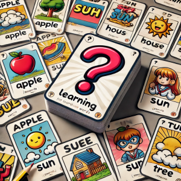
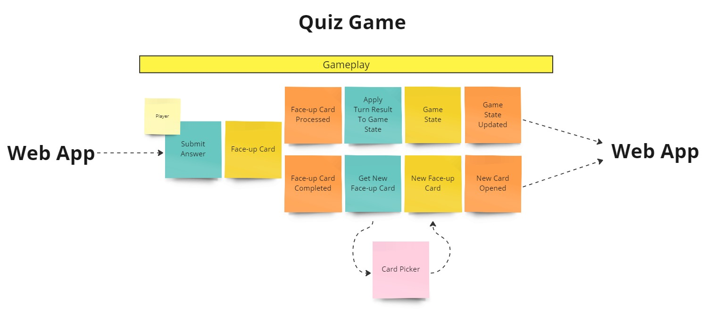
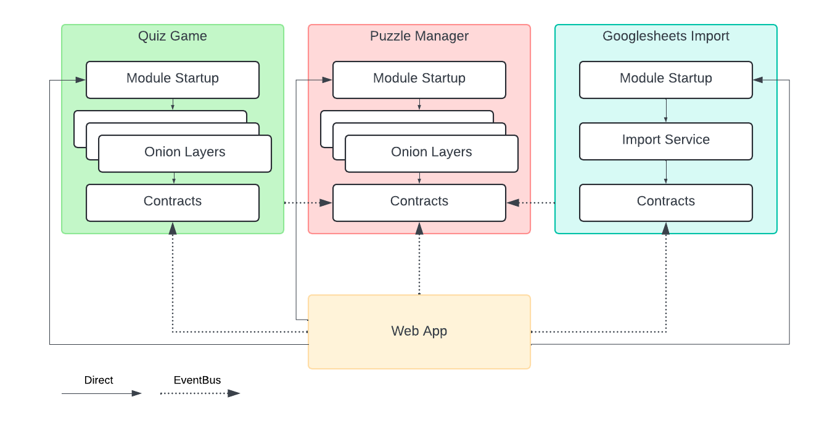
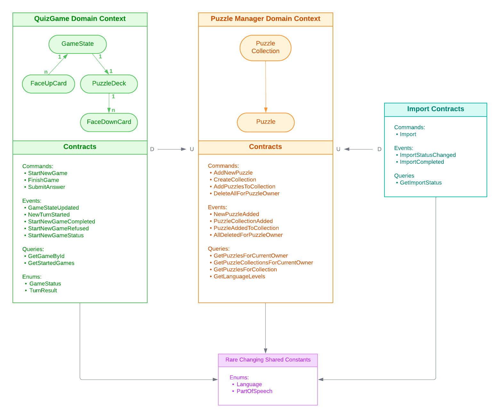
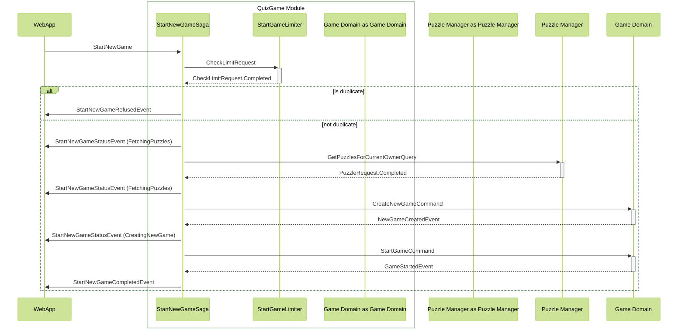
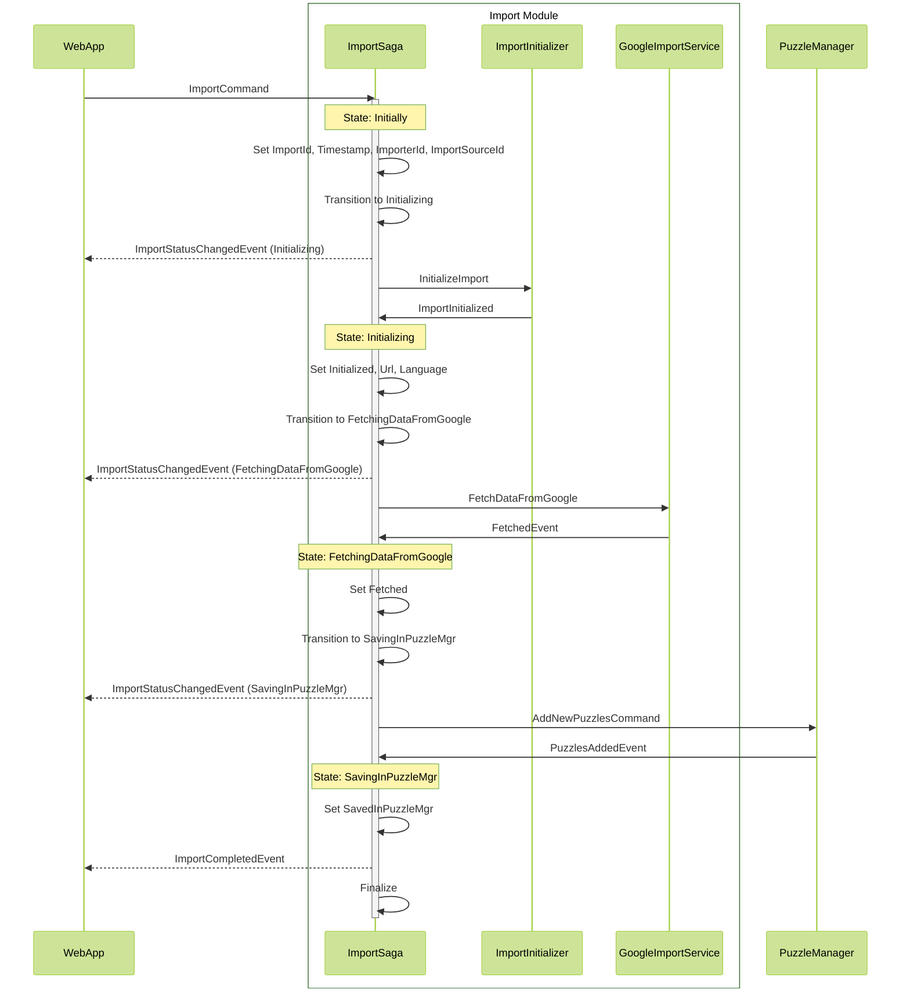

# LexiQuest Game
Modular application built with Clean Architecture and DDD principles which is ready to quickly get splitted into microserves.

<div align="center">

</div>

## Introduction

I think it's long been clear to everyone how to handle order processing in a DDD style. Enough with the repetitive examples! Such examples cover the core principles only superficially, without addressing corner cases at all. Let's imagine how we could design a card game for people learning foreign words. This task is quite atypical for DDD, at least based on what I could find on GitHub. With this example, you can explore:

* HOW TO break down a non-trivial task into bounded-contexts and allocate an independent isolated module for each bounded context, architecturally ensuring the possibility of turning any module into a microservice deployed on a separate machine.
* HOW TO abstract the inter-module interaction mechanism — it's possible to avoid using docker containers, and go for a regular database or even memory for message exchange, for example, to deploy the application on web hosting, and later when required to switch to VPS.
* HOW TO orchestrate long-running processes involving multiple modules — I prefer orchestration through sagas instead of choreography, as this approach provides centralized control of operations, process consistency, and a clear understanding of what is happening and when, improving manageability and transparency.
* HOW TO ensure reliable delivery and processing of inter-module messages and domain events using the outbox pattern.
* HOW TO use domain services for logic involving multiple aggregates, and for non-trival business logic requiring its responsibility to be extracted outside the aggregate.
* HOW TO create a simple way to control access to a user's own resources.

## Frameworks

* **MassTransit** and **RabbitMQ** - inter-service communication.
  
* **MassTransit.Mediator** - for handling domain events.

* **EPPlus** - importing from xlsx.

* **EF Core** - ORM, and **PostgreSQL** - database.

* On the frontend, **Blazor Interactive WebAssembly** is used with RESTful API, along with a bit of **Blazor Bootstrap**. **Auth0** - for authentication, and **SignalR** - handling messages from the backend, including errors.

## How to launch

You need to add an `appsettings.json` file to `LexiQuest.WebApp` and `LexiQuest.WebApp.Client/wwwroot`, specifying the settings for Auth0 and EPPlus, then:

```
docker-compose up
```

## Event Storm diagram



## Dependency diagram



Conracts are:
- Commands
- Queries
- Events

## Context map and contracts



## Start New Game Saga Sequence Chart



## Googlesheets Import Saga Sequence Diagram



## TO-DO
What needs to be done:

* Finish the editing section for puzzles and import sources.
* Add a couple more import options in separate modules, for example, from a text file.
* Add support for puzzle collections and parallel games with different collections. Currently, a user always has one collection and one game.
* The project was written to demonstrate solving architectural tasks; I did not focus on optimizing word-checking algorithms, imports, etc.
* For the same reason, tests were not written, and this needs to be fixed in future.
